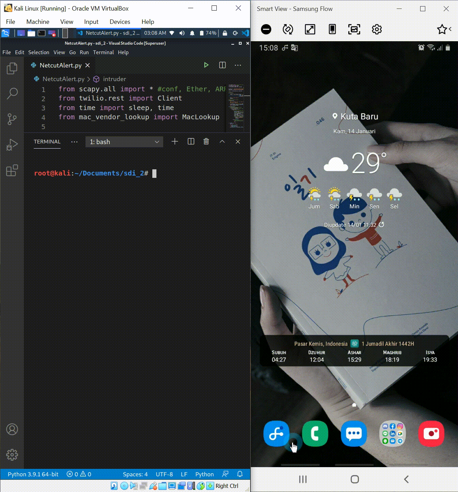

 

  

  <h3 align="center">NetcutAlert</h3>
  

    Final Project Sistem Deteksi dan Intrusi
     
     
  

# [![Product Name Screen Shot][product-screenshot]](https://example.com)
<!--  -->

 

## Daftar ISi

1. [Deskripsi](#Deskripsi)
2. [Requirement](#Requirement)
3. [Cara kerja](#Cara-Kerja)
4. [Instalasi](#Instalasi)
5. [Dokumentasi](#Dokumentasi)

## Deskripsi

Masalah jaringan seperti turunnya bandwidth kerap terjadi saat user mengakses internet melalui layanan publik. Salah satu penyebabnya yaitu terdapat user lain di jaringan tersebut yang telah melakukan *attack* menggunakan *Netcut*. hanya saja, user kerap tidak menyadari upaya intrusi oleh *Netcut* tersebut. Maka munculah ide untuk membuat program bernama NetcutAlert, yang dapat memberikan notifikasi kepada user secara langsung, jika telah terjadi penyerangan Netcut pada jaringan. Sehingga user dapat mengetahui inforamsi terkait intrusi tersebut dengan cepat, dan problem-pun dapat segera ditindak lanjuti. Program ini mendeteksi adanya aktivitas ARP spoofing akibat Netcut pada jaringan user dengan mencocokan MAC address dari paket yang diterima user, dengan MAC address dari default gateway. Kemudian jika terdeteksi, program akan mengirimkan notifikasi intrusi tersebut malalui whatsapp user.

## Requirement

| Req.                     | Ver. Used / Model |
|--------------------------|-------------------|
| Kali OS                  | Rolling           |
| Python Lang              | 3.9.1             |
| Scapy Lib                | 2.4.3             |
| Mac Vendor Lookup Lib    | 0.1.11            |
| Twilio Python Lib        | 6.51.0            |
| Whatsapp App             | 2.20.206.24       |
| Android OS               | 10                |
| Tenda Wireless USB Adpt. | W311Ma            |
|                          |                   |

## Cara Kerja

## Instalasi

## Dokumentasi

<!-- MARKDOWN LINKS & IMAGES -->
<!-- https://www.markdownguide.org/basic-syntax/#reference-style-links -->
[product-screenshot]: images/Documentation.png