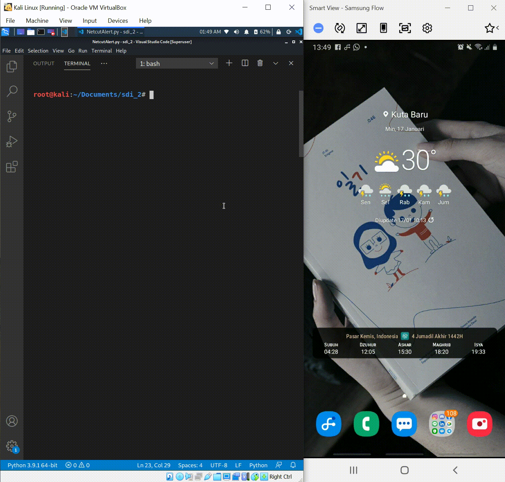

<br />
<p align="center">
  <a href="https://github.com/fvldi/FP_SDI_NetcutAltert">
    
  </a>

  <h3 align="center">NetcutAlert</h3>
  <p align="center">
    Final Project Sistem Deteksi dan Intrusi
    <br>
    <br>
  </p>
</p>

# [![Product Name Screen Shot][product-screenshot]](https://example.com)
<!-- [](https://github.com/fvldi) -->
[](https://github.com/fvldi)
[](https://github.com/fvldi)
[](https://github.com/fvldi)
[](https://github.com/fvldi)

<br>

## Daftar ISi

1. [Deskripsi](#Deskripsi)
2. [Requirement](#Requirement)
3. [Cara kerja](#Cara-Kerja)
4. [Instalasi](#Instalasi)
5. [Penggunaan](#Penggunaan)
6. [Dokumentasi](#Dokumentasi)

## Deskripsi

Masalah jaringan seperti turunnya bandwidth kerap terjadi saat user mengakses internet melalui layanan publik. Salah satu penyebabnya yaitu terdapat user lain di jaringan tersebut yang telah melakukan *attack* menggunakan *Netcut*. hanya saja, user kerap tidak menyadari upaya intrusi oleh *Netcut* tersebut. Maka munculah ide untuk membuat program bernama NetcutAlert, yang dapat memberikan notifikasi kepada user secara langsung, jika telah terjadi penyerangan Netcut pada jaringan. Sehingga user dapat mengetahui inforamsi terkait intrusi tersebut dengan cepat, dan problem-pun dapat segera ditindak lanjuti. Program ini mendeteksi adanya aktivitas ARP spoofing akibat Netcut pada jaringan user dengan mencocokan MAC address dari paket yang diterima user, dengan MAC address dari default gateway. Kemudian jika terdeteksi, program akan mengirimkan notifikasi intrusi tersebut malalui whatsapp user.

## Requirement

| Req.                     | Ver. Used / Model |
|--------------------------|-------------------|
| Kali OS                  | Rolling           |
| Python Lang              | 3.9.1             |
| Scapy Lib                | 2.4.3             |
| Mac Vendor Lookup Lib    | 0.1.11            |
| Twilio Python Lib        | 6.51.0            |
| Whatsapp App             | 2.20.206.24       |
| Android OS               | 10                |
| Tenda Wireless USB Adpt. | W311Ma            |

## Cara Kerja

Cara kerja program ini yaitu diawali dengan mengambil default MAC address dari gateway user, lalu distore ke variabel `real_mac`. Kemudian, mendeteksi mac address dari paket yang diterima oleh user, dan distore ke variabel `response_mac`. Setelah itu, program dilanjut dengan membandingkan default mac address gateway pada variabel `real_mac` dengan source mac address pada variabel `response_mac`. Jika sama, maka tidak terjadi aktivitas netcut pada jaringan user. Sebaliknya jika tidak sama, maka dapat dipastikan telah terjadi aktivitas Netcut pada jaringan user, kemudian program akan mengirimkan notifikasi ke whatsapp user melalui fungsi `intruder()`

## Instalasi

Untuk menggunakan program NetcutAlert, user perlu menginstall library terlebih dahulu, sesuai yang tertera pada section [Requirement](#Requirement) dan beberapa konfigruasi sebagai berikut.

1. Pastikan user menggunakan versi poython 3, jika belum maka disarankan update terlebih dahulu: https://linuxize.com/post/how-to-install-python-3-9-on-ubuntu-20-04/

```
sudo apt install python3.9
```

2. Scapy: https://scapy.readthedocs.io/en/latest/installation.html#installing-scapy-v2-x

```
$ pip install --pre scapy[basic]
```

3. Twilio: https://www.twilio.com/docs/libraries/python

```
pip install twilio
```

4. Jika user menggunakan virtual machine, pastikan wireless adapter telah terkoneksi terlebih dahulu untuk dapat terkoneksi ke jaringan wifi mengunakan `wlan0`. Lewati step ini jika linux terinstal langsung pada device user.
5. Registrasi akun twilio, lalu join ke sandbox whatsapp twilio. Kemudian copy account sid beserta auth token user ke program NetcutALert. Lihat https://www.twilio.com/
6. Karena fungsi notifikasi pada program NetcutAlert memerlukan akses internet, sedangkan tipe serangan Netcut itu sendiri menyebabkan terganggunya bandwidth atau koneksi pada jaringan user, maka dalam beberapa case menyebabkan program NetcutAlert ini mengalami error exception pada fungsi `intruder()` dan program pun berhenti. Namun, hal itu dapat diatasi dengan merestart program tersebut. Oleh karnanya maka perlu mengeksekusi program `run` terlebih dahulu dengan menjalankan perintah:

```
chmod +x run
```

Program `run` berisi perintah yang memungkinkan suatu program lain melakukan restart ketika terjadi error exception, Sehingga jika terjadi error exception pada program NetcutAlert, program dapat otomatis ter-restart dan dapat berjalan kembali.

## Penggunaan

Setelah memenuhi semua konfigurasi yang ada, User dapat menjalankan program NetcutAlert melalui perintah:

```
./run NetcutAlert.py
```

Jika terdeteksi aktivitas Netcut, maka program akan menampilkan tanda `[!] Detected` pada terminal, kemudian setelah program berhasil mengirimkan notifikasi pada whatsapp user, maka akan tampil tanda `[!] Alert sent!`. Program NetcutAlert merekam adanya aktivitas Netcut setiap 10 detik.

## Dokumentasi




<!-- MARKDOWN LINKS & IMAGES -->
<!-- https://www.markdownguide.org/basic-syntax/#reference-style-links -->
[product-screenshot]: images/Documentation.png